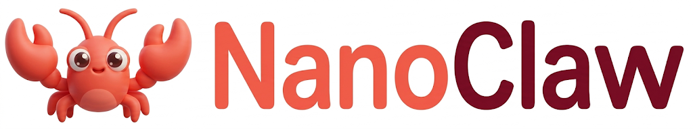

<div align="center">
  
  <h1>nanoclaw: Ultra-Lightweight Personal AI Assistant</h1>
  <p>
    
    
  </p>
</div>

🐈 **nanoclaw** is an **ultra-lightweight** personal AI assistant inspired by OpenClaw.

⚡ Delivers core agent functionality with a minimal and readable architecture.

📏 Real-time line count: run `bash core_agent_lines.sh` to verify anytime.

## 🏗️ Architecture

<p align="center">
  
</p>

## 📦 Install

**Install from source** (recommended for development)

```bash
git clone https://github.com/zqllllll/nano_claw.git
cd nano_claw
pip install -e .
```

## 🚀 Quick Start

**1. Initialize**

```bash
nanoclaw onboard
```

**2. Configure**

Edit `~/.nanoclaw/config.json` and set your provider key and model.

```json
{
  "providers": {
    "openrouter": {
      "apiKey": "sk-or-v1-xxx"
    }
  },
  "agents": {
    "defaults": {
      "model": "anthropic/claude-opus-4-5",
      "provider": "openrouter"
    }
  }
}
```

**3. Run**

```bash
nanoclaw gateway
```

## 💬 Chat Apps

nanoclaw currently documents only the **QQ** channel.

| Channel | What you need |
|---------|---------------|
| **QQ** | App ID + App Secret |

### QQ (QQ单聊)

Uses **botpy SDK** with WebSocket, no public IP required.

**1. Register and create bot**

- Visit [QQ Open Platform](https://q.qq.com)
- Create a bot application
- Copy your **AppID** and **AppSecret**

**2. Configure QQ**

```json
{
  "channels": {
    "qq": {
      "enabled": true,
      "appId": "YOUR_APP_ID",
      "secret": "YOUR_APP_SECRET",
      "allowFrom": ["YOUR_OPENID"],
      "msgFormat": "plain"
    }
  }
}
```

**3. Start service**

```bash
nanoclaw gateway
```

## 📁 Project Structure

```text
nanoclaw/
├── agent/          # Core agent logic
│   ├── loop.py     # Agent loop (LLM -> tool execution)
│   ├── context.py  # Prompt builder
│   ├── memory.py   # Persistent memory
│   ├── skills.py   # Skills loader
│   ├── subagent.py # Background task execution
│   └── tools/      # Built-in tools
├── skills/         # Bundled skills
├── channels/       # Chat channel integrations (QQ focused)
├── bus/            # Message routing
├── cron/           # Scheduled tasks
├── heartbeat/      # Proactive wake-up
├── providers/      # LLM providers
├── session/        # Conversation sessions
├── config/         # Configuration
└── cli/            # Commands
```

